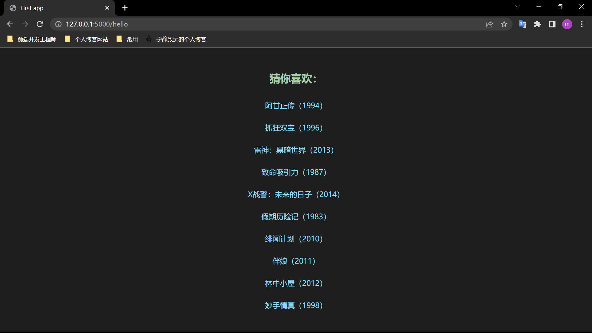

# 简单电影推荐系统
## 本地演示
首先你需要下载本仓库到本地，然后输入以下命令：

1. 进入到项目最外层文件夹，在终端中输入如下命令，创建一个虚拟环境
```
py -3 -m venv venv
```

2. 输入如下命令，用于激活虚拟环境
```
venv\Scripts\activate
```

3. 输入如下命令，用于安装所需依赖
```
pip install -r requirements.txt
```

4. 运行本地服务器，输入如下命令，并按照提示打开对应网址
```
python flask_app.py
```

更多资料请参考 [Flask中文网](https://flask.net.cn/installation.html#id4)

## 在线预览
当然，你也可以在网页端直接预览，你只需要在上方 URL 的 `https://` 后面添加 `gitpod.io/#/`

例如：
```
https://github.com/nginx/nginx => https://gitpod.io/#/github.com/nginx/nginx
```
此时你应该可以看到一个 VS Code 界面的编辑器，在终端中输入以下命令：


1. 输入如下命令，用于安装所需依赖
```
pip install -r requirements.txt
```

2. 运行本地服务器，输入如下命令，并按照提示打开对应网址
```
python flask_app.py
```

## 网页截图



## 问题
由于该算法没有保存模型，所以每次预测都要重新计算，导致程序运行时间长。并且在部署到公共端时，还会报错，错误如下：
```
Internal Server Error
The server encountered an internal error and was unable to complete your request. Either the server is overloaded or there is an error in the application
```

## 参考资料
[Python机器学习（原书第3版）](https://weread.qq.com/web/bookDetail/b5432cc0724ad4a3b5413e1)

[Python大数据分析与机器学习商业案例实战](https://weread.qq.com/web/bookDetail/f4e32d4071e1ec54f4e18f9)

[提交文件到Github仓库](https://blog.csdn.net/stc1247679496/article/details/104269657)

[黑马程序员Flask视频教程](https://www.bilibili.com/video/BV17W41177oE?p=10&spm_id_from=333.337.top_right_bar_window_history.content.click)
